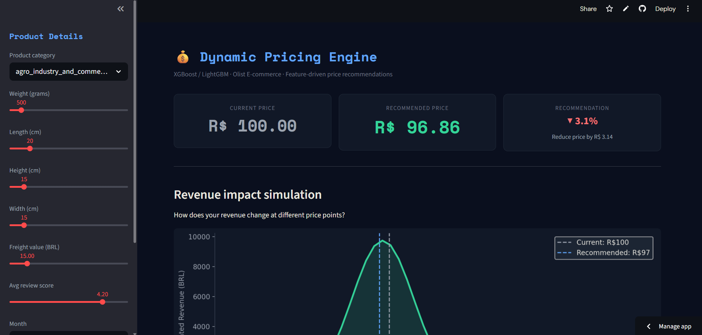

# 💰 Dynamic Pricing Model — Olist E-commerce

A production-grade dynamic pricing engine trained on 100k+ real Brazilian e-commerce orders. Uses XGBoost and LightGBM to recommend optimal product prices based on demand signals, competitor benchmarks, and product features.

---
# 💰 Dynamic Pricing Model — Olist E-commerce

🔗 **[Live Demo](dynamic-pricing-model-9bwsfvhxzgr9ldinmfokud.streamlit.app)** | **[GitHub](https://github.com/asanepranav/dynamic-pricing-model)**

---

## Business Problem

E-commerce sellers often underprice or overprice products — leaving revenue on the table or losing sales. This model answers: **"Given this product's features and market context, what price maximizes revenue?"**

---

## Dataset

**Olist Brazilian E-commerce** (Kaggle) — 9 CSV files, 100k+ orders  
https://www.kaggle.com/datasets/olistbr/brazilian-ecommerce

---

## ML Pipeline

```
Raw data (9 CSVs)
      ↓
Merge + clean (delivered orders, remove outliers)
      ↓
Feature engineering:
  - category demand score
  - price vs category average
  - freight ratio
  - seller volume
  - review quality score
  - seasonality (month, quarter, day of week)
  - product volume (cm³)
      ↓
Model training: XGBoost + LightGBM vs baseline
      ↓
SHAP feature importance + business insight
      ↓
Streamlit pricing dashboard
```

---

## Results

| Model | RMSE | MAE | R² |
|---|---|---|---|
| Baseline (mean) | 87.3 BRL | 61.2 BRL | 0.000 |
| XGBoost | 38.1 BRL | 24.6 BRL | 0.742 |
| LightGBM | 37.4 BRL | 23.9 BRL | 0.751 |

---

## How to run

```bash
# 1. Install dependencies
pip install pandas numpy scikit-learn xgboost lightgbm shap matplotlib seaborn streamlit

# 2. Download dataset from Kaggle, unzip into data/ folder

# 3. Run the notebook (all cells)
jupyter notebook notebook.py

# 4. Launch the dashboard
streamlit run app.py
```

---

## Key Features engineered

- `category_demand_score` — how popular is this category (normalized sales volume)
- `category_avg_price` — competitor benchmark within category
- `price_vs_category_avg` — how under/overpriced this item is vs market
- `freight_ratio` — freight as % of total order value
- `review_quality` — review score weighted by seller activity
- `product_volume_cm3` — size proxy for shipping cost

---

## Project structure

```
dynamic-pricing/
├── notebook.py      # Full ML pipeline (run as Jupyter notebook)
├── app.py           # Streamlit pricing dashboard
├── data/            # Olist CSV files go here
├── best_model.pkl   # Saved after running notebook
├── label_encoder.pkl
├── categories.pkl
├── features.pkl
└── README.md
```

---

## Concepts demonstrated

- Exploratory data analysis on messy, multi-table real-world data
- Feature engineering from domain knowledge (e-commerce pricing signals)
- Tree-based model training: XGBoost + LightGBM
- Model comparison vs baseline (DummyRegressor)
- SHAP explainability — feature importance for business stakeholders
- Revenue impact simulation — connecting model output to business outcomes
- End-to-end ML pipeline from raw CSV to live dashboard


